# 1. 认识thymeleaf

## 1.1. 模板技术

把页面中的静态数据替换成从后台数据库中的数据。这种操作用jsp就可以实现。但是Spring boot 的架构不推荐使用Jsp，而且支持也不好，所以如果你是用springboot的话，一般使用Freemarker或者Thymeleaf。

官方推荐使用**Thymeleaf**。


## 1.2. 简介

官方网站：https://www.thymeleaf.org/index.html

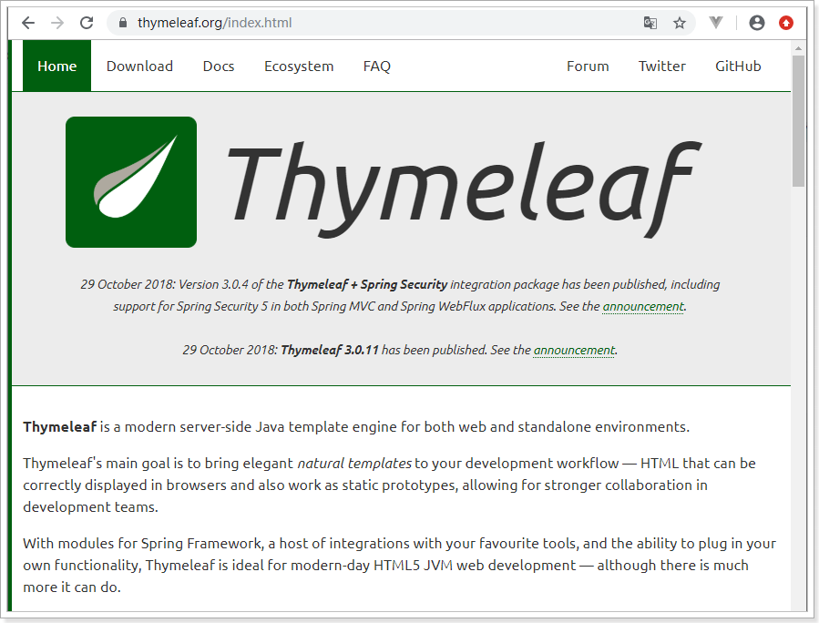

**Thymeleaf**是用来开发Web和独立环境项目的**现代服务器端Java模板引擎**。

Thymeleaf的主要目标是为您的开发工作流程带来优雅的*自然模板* - HTML。可以在直接浏览器中正确显示，并且可以作为静态原型，从而在开发团队中实现更强大的协作。

借助Spring Framework的模块，可以根据自己的喜好进行自由选择，可插拔功能组件，Thymeleaf是现代HTML5 JVM Web开发的理想选择 - 尽管它可以做的更多。

Springboot官方支持的服务端渲染模板中，并不包含jsp。而是Thymeleaf和Freemarker等，而Thymeleaf与SpringMVC的视图技术，及SpringBoot的自动化配置集成非常完美，几乎没有任何成本，你只用关注Thymeleaf的语法即可。


## 1.3. 优势

一般的模板技术（Jsp和Freemarker）都会在页面添加 各种表达式、标签甚至是java代码，而这些都必须要经过后台服务器的渲染才能打开。但如果前端开发人员做页面调整，双击打开某个jsp或者ftl来查看效果，基本上是打不开的。

那么Thymeleaf的优势就出来了，因为Thymeleaf没有使用自定义的标签或语法，所有的模板语言都是扩展了标准H5标签的属性

比如同样给div动态渲染一个文本

thymeleaf：

```html
<div th:text="${item.skuName} ">哈哈</div> 
th:text 表示div显示的文本
${item.skuName} 表示在后台会有一个作用域将数据存储起来
```

Jsp：

```html
<div>${item.skuName}</div>
```

渲染后效果一样，但是如果你直接用浏览器打开页面文件，H5会把th:text这种不认识的属性忽略掉。效果就和<div>哈哈</div> 没有区别，所以对于前端调页面影响更小。以上只是举了一个例子，如果是循环、分支的判断效果更明显。


# 2. 环境准备

我们来创建一个module，为学习Thymeleaf做准备：

## 2.1. 创建module

使用spring 脚手架创建一个demo工程：

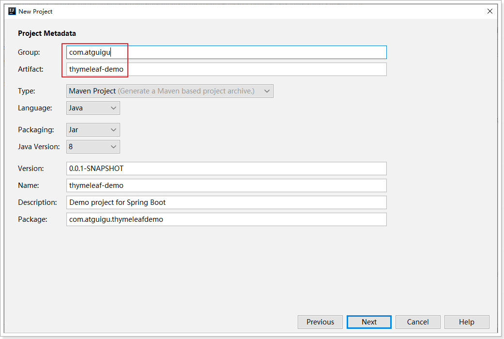


勾选web和Thymeleaf的依赖：

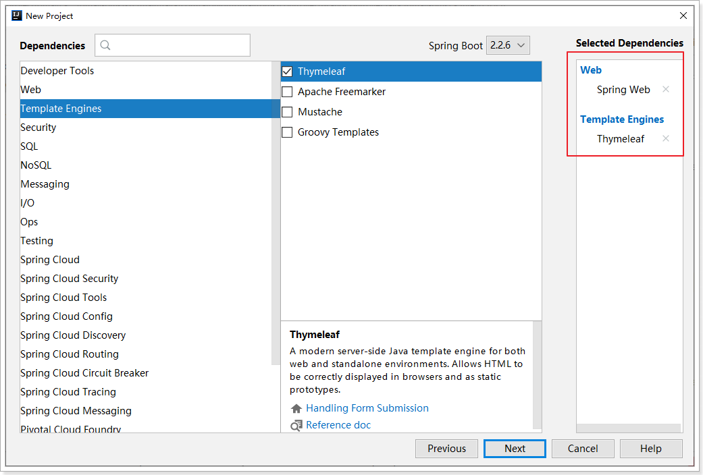

pom：

```xml
<?xml version="1.0" encoding="UTF-8"?>
<project xmlns="http://maven.apache.org/POM/4.0.0" xmlns:xsi="http://www.w3.org/2001/XMLSchema-instance"
         xsi:schemaLocation="http://maven.apache.org/POM/4.0.0 https://maven.apache.org/xsd/maven-4.0.0.xsd">
    <modelVersion>4.0.0</modelVersion>
    <parent>
        <groupId>org.springframework.boot</groupId>
        <artifactId>spring-boot-starter-parent</artifactId>
        <version>2.2.6.RELEASE</version>
        <relativePath/> <!-- lookup parent from repository -->
    </parent>
    <groupId>com.atguigu</groupId>
    <artifactId>thymeleaf-demo</artifactId>
    <version>0.0.1-SNAPSHOT</version>
    <name>thymeleaf-demo</name>
    <description>Demo project for Spring Boot</description>

    <properties>
        <java.version>1.8</java.version>
    </properties>

    <dependencies>
        <dependency>
            <groupId>org.springframework.boot</groupId>
            <artifactId>spring-boot-starter-thymeleaf</artifactId>
        </dependency>
        <dependency>
            <groupId>org.springframework.boot</groupId>
            <artifactId>spring-boot-starter-web</artifactId>
        </dependency>

        <dependency>
            <groupId>org.springframework.boot</groupId>
            <artifactId>spring-boot-starter-test</artifactId>
            <scope>test</scope>
            <exclusions>
                <exclusion>
                    <groupId>org.junit.vintage</groupId>
                    <artifactId>junit-vintage-engine</artifactId>
                </exclusion>
            </exclusions>
        </dependency>
    </dependencies>

    <build>
        <plugins>
            <plugin>
                <groupId>org.springframework.boot</groupId>
                <artifactId>spring-boot-maven-plugin</artifactId>
            </plugin>
        </plugins>
    </build>

</project>
```


Thymeleaf默认会开启页面缓存，提高页面并发能力。但会导致开发时修改页面不会立即被展现，因此关闭缓存：

```properties
# 关闭Thymeleaf的缓存
spring.thymeleaf.cache=false
```

另外，每次修改完毕页面，需要使用快捷键：`Ctrl + Shift + F9`来刷新工程。


## 2.2. 默认配置

不需要做任何配置，启动器已经帮我们把Thymeleaf的视图解析器配置完成。

在spring-boot-autoconfigure依赖包中包含了Thymeleaf的默认配置：

 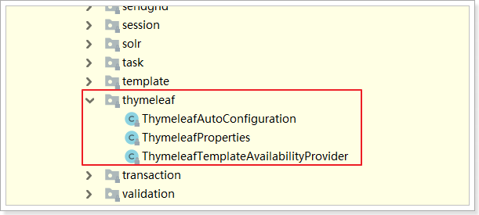


thymeleaf解析方式与jsp类似：前缀 + 视图名 + 后缀。

在Thymeleaf的配置类中配置了默认的前缀和后缀：

 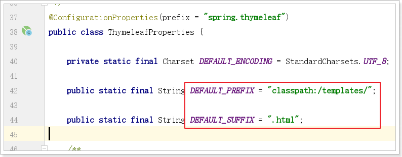

- 默认前缀：`classpath:/templates/`
- 默认后缀：`.html`
- 默认编码：UTF_8

所以如果我们返回视图：`users`，会指向到 `classpath:/templates/users.html`


## 2.3. 快速开始

我们准备一个controller，控制视图跳转：

```java
@Controller
public class HelloController {

    @GetMapping("show1")
    public String show1(Model model){
        model.addAttribute("msg", "Hello, Thymeleaf!");
        return "hello";
    }
}
```


新建一个html模板：

```html
<!DOCTYPE html>
<html lang="en" xmlns:th="http://www.thymeleaf.org">
<head>
    <meta charset="UTF-8">
    <title>hello</title>
</head>
<body>
    <h1 th:text="${msg}">大家好</h1>
</body>
</html>
```

**注意**，把html 的名称空间，改成：`xmlns:th="http://www.thymeleaf.org` 会有语法提示


启动项目，访问页面：


## 2.4. th指令

在这个案例中：

- 静态页面中，`th`指令不被识别，但是浏览器也不会报错，把它当做一个普通属性处理。这样`div`的默认值`大家好`就会展现在页面上
- Thymeleaf环境下，`th`指令就会被识别和解析，而`th:text`的含义就是替**换所在标签中的文本内容**，于是`msg`的值就替代了 `div`中默认的`大家好`

th指令的设计，正是Thymeleaf的高明之处，也是它优于其它模板引擎的原因。动静结合的设计，使得无论是前端开发人员还是后端开发人员可以完美契合。


另外，`th:text`指令出于安全考虑，会把表达式读取到的值进行处理，防止html的注入。

例如，`<p>你好</p>`将会被格式化输出为`$lt;p$gt;你好$lt;/p$lt;`。

**如果想要不进行格式化输出，而是要输出原始内容，则使用`th:utext`来代替.**


# 3. 语法

Thymeleaf的主要作用是把model中的数据渲染到html中，因此其语法主要是如何解析model中的数据。

## 3.1. th:text/utext 基础使用

我们先新建一个实体类：User

```java
@Data
@NoArgsConstructor
@AllArgsConstructor
public class User {
    String name;
    int age;
    User friend;// 对象类型属性
}
```

然后在模型中添加数据

```java
@Controller
public class HelloController {

    @GetMapping("test")
    public String test(Model model){
        User user = new User("锋哥", 22, new User("柳岩", 20, null));
        model.addAttribute("msg", "hello thymeleaf!");
        model.addAttribute("user", user);
        return "hello";
    }
}
```

> 语法说明：

Thymeleaf通过`${}`来获取model中的变量，注意这不是el表达式，而是ognl表达式，但是语法非常像。

> 示例：

我们在页面获取user数据：

```html
<!doctype html>
<html lang="en" xmlns:th="http://www.thymeleaf.org">
<head>
    <meta charset="utf-8">
    <title>title</title>
</head>
<body>
    <h1 th:text="${msg}">大家好！</h1>
    <h1>
        <!-- 常规用法 -->
        欢迎您：<span th:text="${user.name}">请登录</span>
    </h1>
    <h1>
        <!-- 常量：有些内容可能不希望thymeleaf解析为变量 -->
        字符串常量：<span th:text="'欢迎您'"></span><br>
        数字常量：<span th:text="2020"></span><br>
        数字常量运算：<span th:text="2020 - 10"></span><br>
        bool常量：<span th:text="true"></span>
    </h1>
    <h1>
        <!-- 字符串拼接：下面两种方式等价 -->
        <span th:text="'欢迎您，' + ${user.name}"></span><br>
        <!-- 简写方式：使用‘|’围起来 -->
        <span th:text="|欢迎您，${user.name}|"></span>
    </h1>
    <h1>
        <!-- 运算：运算符放在${}外 -->
        10年后，我<span th:text="${user.age} + 10"></span>岁<br>
        <!-- 比较：gt (>), lt (<), ge (>=), le (<=), not (!), eq (==), neq/ne (!=) -->
        比较结果：<span th:text="${user.age} < ${user.friend.age}"></span><br>
        <!-- 三元运算 -->
        三元：<span th:text="${user.age}%2 == 0 ? '帅' : '不帅'"></span><br>
        <!-- 默认值：注意`?:`之间没有空格 -->
        默认值：<span th:text="${user.name} ?: '硅谷刘德华'"></span>
    </h1>
</body>
</html>
```

效果：

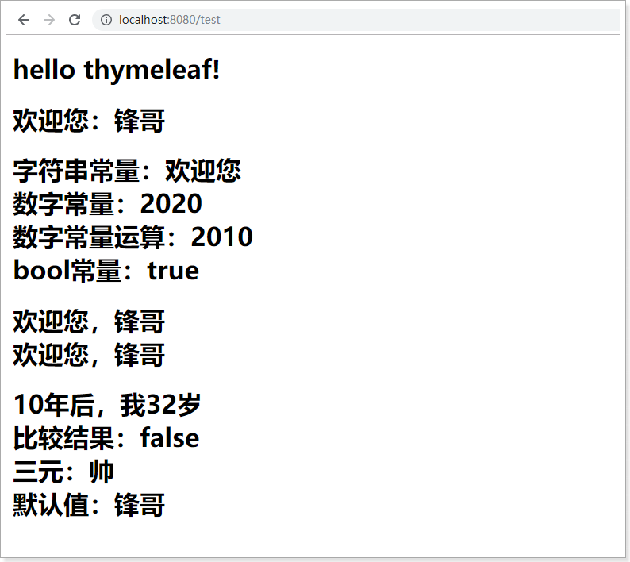


## 3.2. th:object 自定义变量

看下面的案例：

```html
<h2>
    <p th:text="${user.name}">Jack</p>
    <p> th:text="${user.age}">21</p>
    <p th:text="${user.friend.name}">Rose</p>
</h2>
```

我们获取用户的所有信息，分别展示。

当数据量比较多的时候，频繁的写`user.`就会非常麻烦。

因此，Thymeleaf提供了自定义变量来解决：

```html
<h1 th:object="${user}">
    <p th:text="*{name}">Jack</p>
    <p th:text="*{age}">21</p>
    <p th:text="*{friend.name}">Rose</p>
</h1>
```

- 在 `h2`上 用 `th:object="${user}"`获取user的值，并且保存
- 在`h2`内部的任意元素上，可以通过 `*{属性名}`的方式，来获取user中的属性，这样就省去了`user.`前缀了


## 3.3. th:each 循环

在controller方法中，响应users数据模型：

```java
List<User> users = Arrays.asList(
    new User("柳岩", 21, null),
    new User("锋哥", 22, null),
    new User("杨紫", 23, null),
    new User("小鹿", 24, null)
);
model.addAttribute("users", users);
```

页面渲染方式如下：

```html
<table>
    <tr th:each="user: ${users}">
        <td th:text="${user.name}"></td>
        <td th:text="${user.age}"></td>
    </tr>
</table>
```

${users} 是要遍历的集合，可以是以下类型：

- Iterable，实现了Iterable接口的类
- Enumeration，枚举
- Interator，迭代器
- Map，遍历得到的是Map.Entry
- Array，数组及其它一切符合数组结果的对象


在迭代的同时，我们也可以获取迭代的状态对象：

```html
<table>
    <tr th:each="user,stat: ${users}">
        <td th:text="${stat.index + 1}"></td>
        <td th:text="${user.name}"></td>
        <td th:text="${user.age}"></td>
    </tr>
</table>
```

stat对象包含以下属性：

- index，从0开始的角标
- count，元素的个数，从1开始
- size，总元素个数
- current，当前遍历到的元素
- even/odd，返回是否为奇偶，boolean值
- first/last，返回是否为第一或最后，boolean值


效果如下：


## 3.4. th:if 逻辑判断

有了`if和else`，我们能实现一切功能^_^。

Thymeleaf中使用`th:if` 或者 `th:unless` ，两者的意思恰好相反。

```html
<table>
    <tr th:each="user,stat: ${users}" th:if="${user.age > 22}">
        <td th:text="${stat.index + 1}"></td>
        <td th:text="${user.name}"></td>
        <td th:text="${user.age}"></td>
    </tr>
</table>
```

如果表达式的值为true，则标签会渲染到页面，否则不进行渲染。

以下情况被认定为true：

- 表达式值为true
- 表达式值为非0数值或者字符串
- 表达式值为字符串，但不是`"false"`,`"no"`,`"off"`
- 表达式不是布尔、字符串、数字、字符中的任何一种

其它情况包括null都被认定为false


## 3.5. th:switch 分支控制

这里要使用两个指令：`th:switch` 和 `th:case`，类似Java的switch case语句

```html
<div th:switch="${user.role}">
  <p th:case="'admin'">用户是管理员</p>
  <p th:case="'manager'">用户是经理</p>
  <p th:case="*">用户是别的玩意</p>
</div>
```

需要注意的是，一旦有一个th:case成立，其它的则不再判断。与java中的switch是一样的。

另外`th:case="*"`表示默认，放最后。


## 3.6. th:href 动态链接

动态链接可以通过以下两种方式生成：

```html
<!-- 直接拼接字符串 -->
<a th:href="@{'http://api.gmall.com/pms/brand?pageNum=' + ${pageNum}}">点我带你飞</a><br>
<!-- 使用（）的形式定义参数 -->
<a th:href="@{http://api.gmall.com/pms/brand/{id}(id=${id)}">点我带你飞</a><br>
<!-- 使用（,,）的形式解析多个参数 -->
<a th:href="@{http://api.gmall.com/pms/brand(pageNum=${pageNum}, pageSize=${pageSize})}">起飞吧</a>
```

`th:src`和`th:href`用法一致。


## 3.7. 表单操作

```html
<form th:action="@{/login}">
    <input type="hidden" th:value="${url}" name="redirect_url">
    用户名：<input type="text" name="username"><br />
    密&emsp;码：<input type="password" name="password"><br />
    <input type="submit" value="登录"/>
</form>
```

th:action	表单提交路径

th:value	给表单元素绑定value值


## 3.8. 方法及内置对象

ognl表达式本身就支持方法调用，例如：

```html
<h1 th:object="${user}">
    <p th:text="*{name.split('')[0]}"></p>
    <p th:text="*{age}"></p>
    <p th:text="*{friend.name}"></p>
</h1>
```

这里我们调用了name（是一个字符串）的split方法。


Thymeleaf中提供了一些内置对象，并且在这些对象中提供了一些方法，方便我们来调用。获取这些对象，需要使用`#对象名`来引用。


**常用的内置对象：**

1. **ctx** ：上下文对象。

2. **vars** ：上下文变量。

3. **locale**：上下文的语言环境。

4. **request**：（仅在web上下文）的 HttpServletRequest 对象。

5. **response**：（仅在web上下文）的 HttpServletResponse 对象。

6. **session**：（仅在web上下文）的 HttpSession 对象。

7. **servletContext**：（仅在web上下文）的 ServletContext 对象

这里以常用的Session举例，用户刊登成功后，会把用户信息放在Session中，Thymeleaf通过内置对象将值从session中获取。

```java
// java 代码将用户名放在session中
session.setAttribute("userinfo",username);
// Thymeleaf通过内置对象直接获取
th:text="${session.userinfo}"
```


**常用的内置方法：**

1. **strings**：字符串格式化方法，常用的Java方法它都有。比如：equals，equalsIgnoreCase，length，trim，toUpperCase，toLowerCase，indexOf，substring，replace，startsWith，endsWith，contains，containsIgnoreCase等

2. **numbers**：数值格式化方法，常用的方法有：formatDecimal等

3. **bools**：布尔方法，常用的方法有：isTrue，isFalse等

4. **arrays**：数组方法，常用的方法有：toArray，length，isEmpty，contains，containsAll等

5. **lists**，**sets**：集合方法，常用的方法有：toList，size，isEmpty，contains，containsAll，sort等

6. **maps**：对象方法，常用的方法有：size，isEmpty，containsKey，containsValue等

7. **dates**：日期方法，常用的方法有：format，year，month，hour，createNow等

我们在model中添加日期类型响应数据：

```java
@GetMapping("test")
public String test(Model model){
    User user = new User("锋哥", 22, new User("柳岩", 20, null));
    model.addAttribute("msg", "hello thymeleaf!");
    model.addAttribute("user", user);
    model.addAttribute("today", new Date());
    return "hello";
}
```

在页面中处理

```html
<h1 th:text="${#dates.format(today, 'yyyy-MM-dd')}"></h1>
<h1 th:text="${#numbers.formatDecimal(user.age, 1, 2)}"></h1>
```

 效果：


## 3.9. th:inline js内联

模板引擎不仅可以渲染html，也可以对JS中的进行预处理。而且为了在纯静态环境下可以运行，其Thymeleaf代码可以被注释起来：

```html
<script th:inline="javascript">
    const user = [[${user}]];
    const users = [[${users}]];
    const age = [[${user.age}]];
    console.log(user);
    console.log(users);
    console.log(age)
</script>
```

- 在script标签中通过`th:inline="javascript"`来声明这是要特殊处理的js脚本

  因为Thymeleaf被注释起来，因此即便是静态环境下， js代码也不会报错，而是采用表达式后面跟着的默认值。


看看页面的源码：

```html
<script>
    const user = {"name":"\u950B\u54E5","age":22,"friend":{"name":"\u67F3\u5CA9","age":20,"friend":null}};
    const users = [{"name":"\u67F3\u5CA9","age":21,"friend":null},{"name":"\u950B\u54E5","age":22,"friend":null},{"name":"\u6768\u7D2B","age":23,"friend":null},{"name":"\u5C0F\u9E7F","age":24,"friend":null}];
    const age = 22;
    console.log(user);
    console.log(users);
    console.log(age)
</script>
```

我们的User对象被直接处理为json格式了，非常方便。


## 3.10. 页面引用

th:fragment : 定义一个通用的html片段

th:insert   ：保留自己的主标签，保留th:fragment的主标签。

th:replace ：不要自己的主标签，保留th:fragment的主标签。

th:include ：保留自己的主标签，不要th:fragment的主标签。（官方3.0后不推荐）

```html
<!-- 定义一个通用的fragment -->
<footer th:fragment="copy">
    <script type="text/javascript" th:src="@{/plugins/jquery/jquery-3.0.2.js}"></script>
</footer>

<!-- templatename::selector：”::”前面是模板文件名，后面是选择器
    ::selector：只写选择器，这里指fragment名称，则加载本页面对应的fragment
    templatename：只写模板文件名，则加载整个页面
-->
<div th:insert="::copy"></div>
<div th:replace="::copy"></div>
<div th:include="::copy"></div>
```

解析后：

```html
<footer>
    <script type="text/javascript" src="/plugins/jquery/jquery-3.0.2.js"></script>
</footer>

<div>
    <footer>
        <script type="text/javascript" src="/plugins/jquery/jquery-3.0.2.js"></script>
    </footer>
</div>
<footer>
    <script type="text/javascript" src="/plugins/jquery/jquery-3.0.2.js"></script>
</footer>
<div>
    <script type="text/javascript" src="/plugins/jquery/jquery-3.0.2.js"></script>
</div>
```


# 4. 静态资源部署

web项目大部分的请求都是静态资源请求，为了提高并发能力，可以直接部署到nginx。

把课前资料\前端工程\静态资源.rar解压，上传到虚拟机/opt/static目录下：

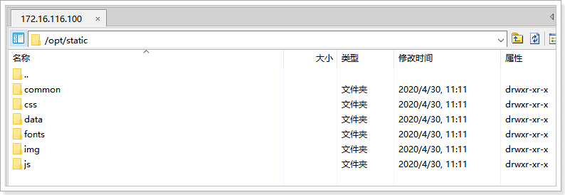

接下来，修改nginx的配置文件，添加一个server配置，使静态资源可以正常的通过nginx访问：

```nginx
server {
    listen       80;
    server_name  static.gmall.com;

    location ~ /(css|data|fronts|img|js|common)/ {
        root   /opt/static;
    }
}
```

执行：nginx -s reload

重新加载nginx配置文件，然后在浏览器中访问一个静态资源如下：


# 5. 搜索页数据联调

把课前资料《资料\前端工程\动态页面》中的search.html及common目录copy到gmall-search工程的templates目录下：

 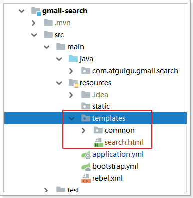

页面的body主要结构如下：

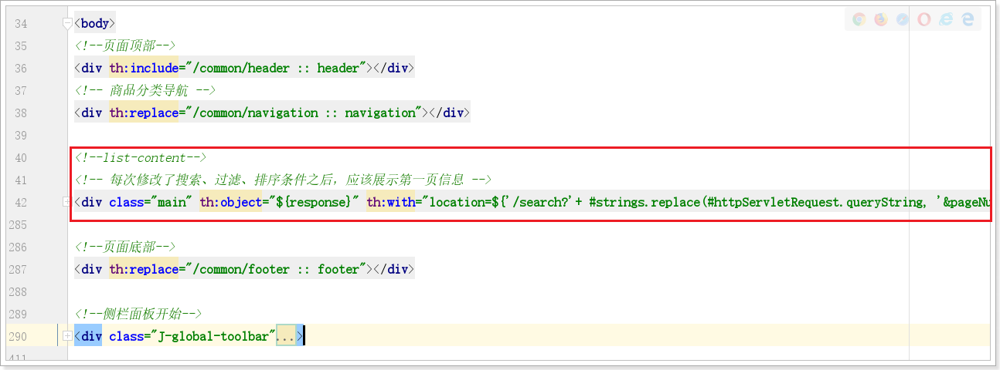

包括通用的：页面顶部（页头），商品分类导航（菜单），页面底部（页脚），侧面板等。这些直接引用common目录下的资源即可。接下来主要分析红框内的这部分，进行分析。


## 5.1. 最外层div

首先在最外层的div上定义了响应数据的最外层对象，方便使用里面的数据，不用反复解包响应数据：

```
th:object="${response}"
```

定义了一个thymeleaf变量location，统一获取带有请求参数的地址栏路径。因为后续所有的点击事件，都需要基于当前地址栏路径，进行修改：

```
th:with="location=${'/search?'+ #strings.replace(#httpServletRequest.queryString, '&pageNum=' + searchParam.pageNum, '')}"
```

#httpServletRequest.queryString：请求参数字符串

使用 #strings.replace 把请求参数字符串中的分页参数去掉，因为当用户修改了搜索、过滤、排序、分页之后，当前页码就不需要了。


改造SearchController的search方法，跳转到search.html页码并封装响应数据：

```java
@GetMapping
public String search(SearchParamVo paramVo, Model model){

    SearchResponseVo responseVo = this.searchService.search(paramVo);

    model.addAttribute("response", responseVo);
    model.addAttribute("searchParam", paramVo);

    return "search";
}
```


展开后主要包括：

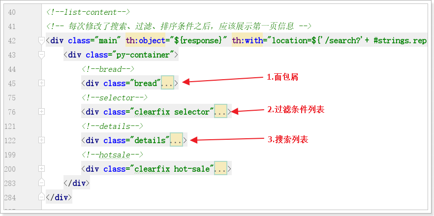


## 5.2. 面包屑

对应jd搜索页的面包屑如下：

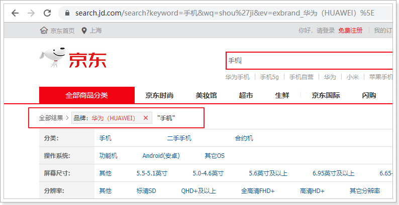


我们面包屑的结构如下：

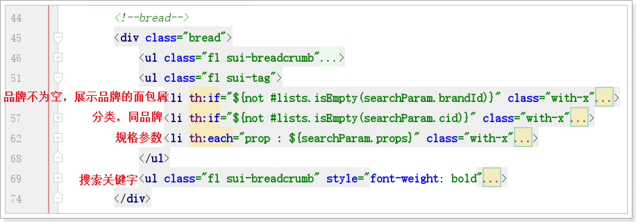


品牌的面包屑渲染：

```html
<li th:if="${not #lists.isEmpty(searchParam.brandId)}" class="with-x">
    <span>品牌：</span>
    <!-- 品牌可以多选，多选情况下品牌名以空格进行分割 -->
    <span th:each="brand : *{brands}" th:text="${brand.name + ' '}"></span>
    <!-- 点击x时，去掉地址栏中的品牌过滤条件 -->
    <a th:href="@{${#strings.replace(location, '&brandId='+ #strings.arrayJoin(searchParam.brandId, ','), '')}}">×</a>
</li>
```


分类的面包屑渲染：

```html
<li th:if="${not #lists.isEmpty(searchParam.cid)}" class="with-x">
    <span>分类：</span>
    <!-- 分类也可以多选，多选时情况下分类名称以空格分割 -->
    <span th:each="category : *{categories}" th:text="${category.name + ' '}"></span>
    <!-- 点击x时，去掉地址栏中的分类过滤条件 -->
    <a th:href="@{${#strings.replace(location, '&cid='+ #strings.arrayJoin(searchParam.cid, ','), '')}}">×</a>
</li>
```


规格参数的面包屑渲染：

```html
<li th:each="prop : ${searchParam.props}" class="with-x">
    <!-- 规格参数的格式为“8:128G-256G”，这里获取“:”号后的规格参数展示 -->
    <span th:with="(propName = ${#strings.substringAfter(prop, ':')})" th:text="${propName}"></span>
    <!--<a th:href="@{${#strings.replace(location, '&props=' + prop, '')}}" th:text="${'&props=' + prop}">×</a>-->
    <!-- 这里不能使用thymeleaf的替换语法（如上），因为thymeleaf获取的地址：中文及特殊符号是编码后的 -->
    <a th:href="@{'javascript: cancelProp(\'' + ${prop} + '\');'}">×</a>
</li>
```

对应的js如下：

```javascript
let urlParams = decodeURI([[${#httpServletRequest.queryString}]]);

function cancelProp(prop){
    urlParams = urlParams.replace('&props=' + prop, '');
	window.location = '/search?' + urlParams;
}
```


搜索条件：

```html
<ul class="fl sui-breadcrumb" style="font-weight: bold">
    <li>
        <span th:text="${searchParam.keyword}"></span>
    </li>
</ul>
```


## 5.3. 过滤条件

对应京东的过滤条件如下：

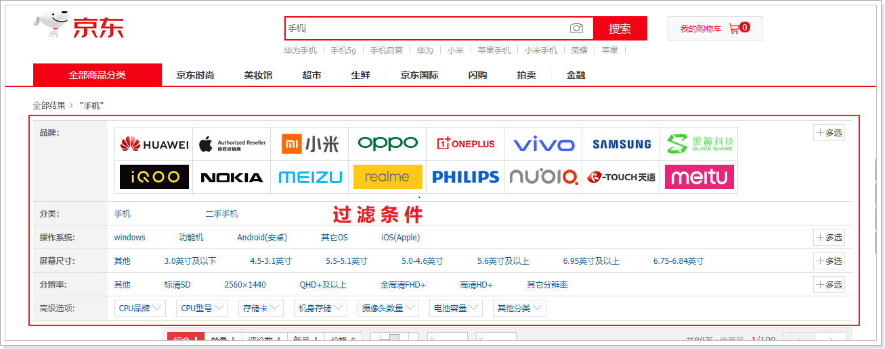


我们的过滤条件前端结构如下：


包括：品牌过滤、分类过滤、规格参数过滤


品牌过滤渲染如下：

```html
<!-- 品牌过滤：只有一个品牌或者已经选择了品牌时，不显示品牌过滤 -->
<div class="type-wrap logo" th:if="${response.brands == null && response.brands.size() > 1 && searchParam.brandId == null}">
    <!-- 过滤名称写死，就是品牌 -->
    <div class="fl key brand">品牌</div>
    <div class="value logos">
        <ul class="logo-list">
            <!-- 遍历品牌集合 -->
            <li th:each="brand : *{brands}">
                <!-- 选择品牌后把品牌id拼接到地址栏 -->
                <a class="brand" style="text-decoration: none;color: red;" th:href="@{${location + '&brandId=' + brand.id}}" th:title="${brand.name}" >
                    <!-- 渲染品牌logo及品牌名称，通过js控制log和名称的切换 -->
                    
                    <div th:text="${brand.name}" style="display: none"></div>
                </a>
            </li>
        </ul>
    </div>
    <!-- 多选及更多，不做 -->
    <div class="ext">
        <a href="javascript:void(0);" class="sui-btn">多选</a>
        <a href="javascript:void(0);">更多</a>
    </div>
</div>
```

品牌logo及名称切换的js如下：

```html
<script >
    $(function () {
        $('.brand').hover(function(){
            /*显示品牌名称*/
            $(this).children("div").show()
            $(this).children("img").hide()
        },function(){
            // alert("come on!")
            $(this).children("div").hide()
            $(this).children("img").show()
        });
    })
</script>
```


分类过滤条件的渲染：

```html
<!-- 分类过滤：只有一个分类或者已经选择了分类时，不显示分类过滤 -->
<div class="type-wrap" th:if="${response.categories != null && response.categories.size() > 1 && searchParam.cid == null}">
    <!-- 过滤名称写死，就是分类 -->
    <div class="fl key">分类</div>
    <div class="fl value">
        <ul class="type-list">
            <!-- 遍历所有分类过滤条件 -->
            <li th:each="category : *{categories}">
                <!-- 展示分类名称，点击时把分类id拼接到地址栏 -->
                <a th:text="${category.name}" th:href="@{${location + '&cid=' + category.id}}">GSM（移动/联通2G）</a>
            </li>
        </ul>
    </div>
    <div class="fl ext"></div>
</div>
```


规格参数的过滤：

```html
<!-- 规格参数的过滤条件：由于规格过滤是多个，所以这里需要遍历。也要判断规格参数是否只有一个条件，地址栏是否包含了该规格参数的过滤 -->
<div class="type-wrap" th:each="filter : *{filters}"
     th:if="${filter.attrValues != null && filter.attrValues.size() > 1 && not (#strings.contains(location, ',' + filter.attrId + ':') || #strings.contains(location, '=' + filter.attrId + ':'))}" >
    <!-- 规格参数名 -->
    <div class="fl key" th:text="${filter.attrName}">显示屏尺寸</div>
    <div class="fl value">
        <ul class="type-list">
            <!-- 遍历渲染规格参数可选值列表 -->
            <li th:each="value : ${filter.attrValues}">
                <!-- 展示每个规格参数值。点击时把规格参数的过滤条件拼接到地址栏 -->
                <a th:text="${value}" th:href="@{${location + '&props=' + filter.attrId + ':' + value}}">3.0-3.9英寸</a>
            </li>
        </ul>
    </div>
    <div class="fl ext"></div>
</div>
```


## 5.4. 商品列表

参照京东的商品列表如下：


包含3部分内容：排序、商品列表、分页等


排序渲染：

```html
<!-- 排序条件 -->
<div class="sui-navbar">
    <div class="navbar-inner filter" >
        <ul class="sui-nav">
            <!-- 排序sort=0时，该li标签处于活性状态 -->
            <li th:class="${searchParam.sort == 0 ? 'active' : ''}">
                <!-- 点击综合时，地址栏的sort值替换为0 -->
                <a th:href="@{${#strings.replace(location, '&sort=' + searchParam.sort, '&sort=0')}}">综合</a>
            </li>
            <li th:class="${searchParam.sort == 4 ? 'active' : ''}">
                <a th:href="@{${#strings.replace(location, '&sort=' + searchParam.sort, '&sort=4')}}">销量</a>
            </li>
            <li th:class="${searchParam.sort == 3 ? 'active' : ''}">
                <a th:href="@{${#strings.replace(location, '&sort=' + searchParam.sort, '&sort=3')}}">新品</a>
            </li>
            <li th:class="${searchParam.sort == 1 ? 'active' : ''}">
                <a th:href="@{${#strings.replace(location, '&sort=' + searchParam.sort, '&sort=1')}}">价格⬆</a>
            </li>
            <li th:class="${searchParam.sort == 2 ? 'active' : ''}">
                <a th:href="@{${#strings.replace(location, '&sort=' + searchParam.sort, '&sort=2')}}">价格⬇</a>
            </li>
        </ul>
    </div>
</div>
```


商品列表的渲染：

```html
<div class="goods-list">
    <ul class="yui3-g">
        <!-- 遍历goodsList，渲染商品 -->
        <li class="yui3-u-1-5" th:each="goods : *{goodsList}">
            <div class="list-wrap">
                <!-- 商品图片 -->
                <div class="p-img">
                    <!-- 点击图片跳转到商品详情页 -->
                    <a th:href="@{http://item.gmall.com/{id}.html(id=${goods.skuId})}" target="_blank"></a>
                </div>
                <!-- 商品价格 -->
                <div class="price">
                    <strong>
                        <em>¥</em>
                        <i th:text="${goods.price}">6088.00</i>
                    </strong>
                </div>
                <!-- 商品标题 -->
                <div class="attr">
                    <!-- 点击标题跳转到商品详情页，鼠标放在标题上展示副标题 -->
                    <a target="_blank" th:href="@{http://item.gmall.com/{id}.html(id=${goods.skuId})}" th:title="${goods.subTitle}">Apple苹果iPhone
                        6s (A1699)Apple苹果iPhone 6s (A1699)Apple苹果iPhone 6s (A1699)Apple苹果iPhone 6s
                        (A1699)</a>
                </div>
                <div class="commit">
                    <i class="command">已有<span>2000</span>人评价</i>
                </div>
                <div class="operate">
                    <a href="javascript:void(0);" target="_blank" class="sui-btn btn-bordered btn-danger">加入购物车</a>
                    <a href="javascript:void(0);" class="sui-btn btn-bordered">收藏</a>
                </div>
            </div>
        </li>
    </ul>
</div>
```


分页条件的渲染：

```html
<div class="fr page">
    <!-- 根据总记录数及pageSize计算总页数 -->
    <div class="sui-pagination pagination-large"
         th:with="totalPage = *{total % pageSize == 0 ? (total / pageSize) : (total / pageSize + 1)}">
        <ul>
            <!-- 不是第一页时，展示上一页 -->
            <li class="prev" th:if="${searchParam.pageNum != 1}">
                <!-- 点击上一页，页码减1 -->
                <a th:href="|${location}&pageNum=${searchParam.pageNum - 1}|">«上一页</a>
            </li>
            <!-- 如果是第一页，上一页按钮不可用 -->
            <li class="prev disabled" th:if="${searchParam.pageNum == 1}">
                <a href="javascript:void(0);">上一页</a>
            </li>
            <!-- 渲染页码 -->
            <li th:each="i : ${#numbers.sequence(1, totalPage)}" th:class="${i == searchParam.pageNum } ? 'active' : ''">
                <a th:href="|${location}&pageNum=${i}|"><span th:text="${i}"></span></a>
            </li>
            <!-- 渲染下一页，逻辑类似于上一页 -->
            <li class="next" th:if="${searchParam.pageNum != totalPage}">
                <a th:href="|${location}&pageNum=${searchParam.pageNum + 1}|">下一页</a>
            </li>
            <li class="next disabled" th:if="${searchParam.pageNum == totalPage}">
                <a href="javascript:void(0);">下一页</a>
            </li>
        </ul>
        <!-- 总页数 -->
        <div><span th:text="|共${totalPage}页|">共10页&nbsp;</span></div>
    </div>
</div>
```


