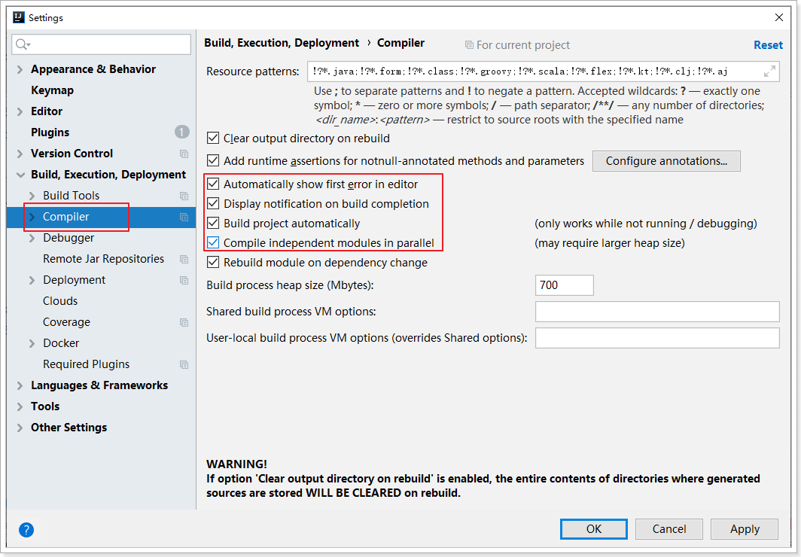
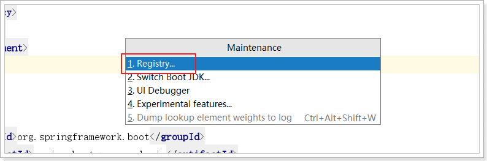
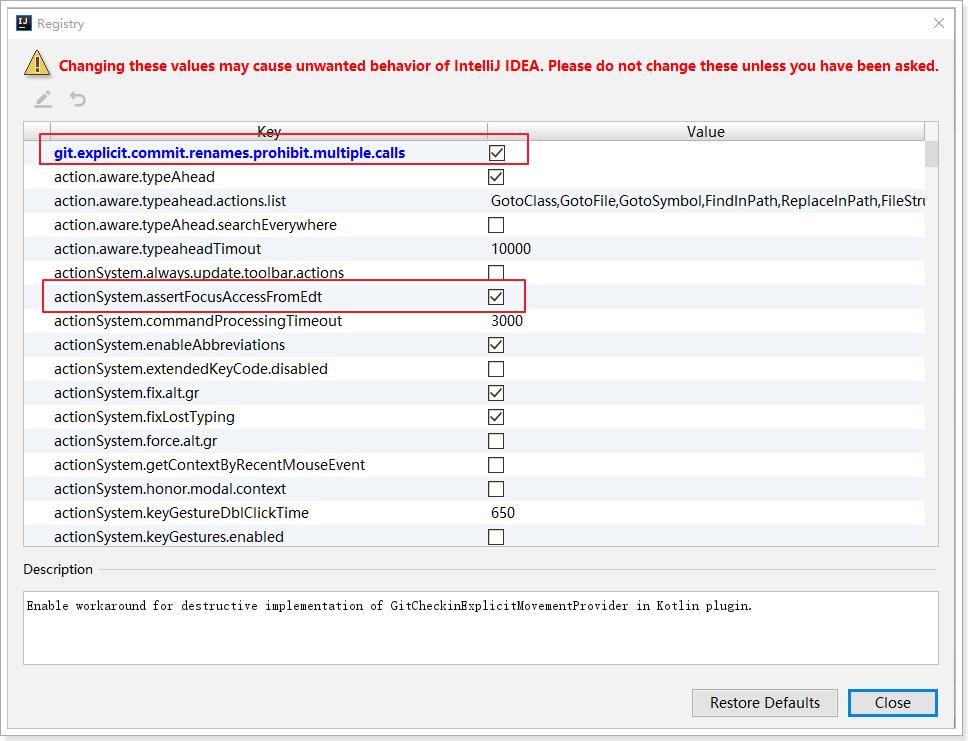

# devtools

第一步：添加相应的依赖：

```xml
<!--devtools可以实现页面热部署（即页面修改后会立即生效，这个可以直接在application.properties文件中配置spring.thymeleaf.cache=false来实现），             
实现类文件热部署（类文件修改后不会立即生效），实现对属性文件的热部署。   
即devtools会监听classpath下的文件变动，并且会立即重启应用（发生在保存时机），注意：因为其采用的虚拟机机制，该项重启是很快的 -->

<dependency>
      <groupId>org.springframework.boot</groupId>
       <artifactId>spring-boot-devtools</artifactId>
       <optional>true</optional>
       <scope>true</scope>
</dependency>
```

 

第二步：替换的spring-boot-maven-plugin

```xml
 <build>
     <plugins>
         <plugin>
             <groupId>org.springframework.boot</groupId>
             <artifactId>spring-boot-maven-plugin</artifactId>
             <configuration>
                 <!--fork:  如果没有该项配置，devtools不会起作用，即应用不会restart -->
                 <fork>true</fork>
             </configuration>
         </plugin>
     </plugins>
</build>
```


第三步：开启idea的自动编译功能




第四步：在idea中使用快捷键：ctrl + shift + alt + /



勾选以下两项：



重启idea。